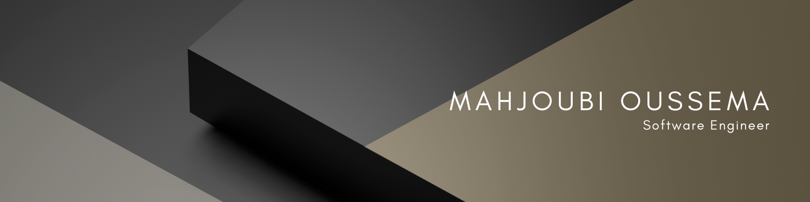

#Mahjoubi's Oussema Portfolio Website 🚀

*Dynamic and responsive personal portfolio showcasing my journey as a Software Engineer specializing in DevSecOps, AI, and full-stack development.*

## 📖 Overview

This repository hosts my personal portfolio website, built to highlight my professional experience, skills, projects, and services as a Software Engineering graduate. The site is designed with a clean, modern aesthetic using Bootstrap 5, ensuring responsiveness across devices. It serves as a central hub for potential employers, collaborators, and clients to explore my work in DevSecOps, AI-driven solutions, data automation, and more.

**Key highlights**:
- **DevSecOps Expertise**: Automated vulnerability analysis with a 40% efficiency gain using tools like Snyk, Jenkins, and AI models.
- **AI Integration**: Developed conversational chatbots with Retrieval-Augmented Generation (RAG) and Qwen.
- **Full-Stack Proficiency**: Projects in Angular, FastAPI, Spring Boot, and microservices architectures.

## ✨ Features

- **Interactive Sections**: Navigate seamlessly through Home, About, Skills, Resume, Services, and Contact.
- **Skills Visualization**: Progress bars for key competencies like Python (95%), DevSecOps (90%), and Power BI (90%).
- **Resume Download**: Direct link to my CV in PDF format.
- **Contact Form**: Integrated with Formspree for easy messaging (with loading, success, and error feedback).
- **Animations & Effects**: Powered by AOS for smooth fade-ins and Typed.js for dynamic text.
- **Social Links**: Quick access to LinkedIn, GitHub, and email.
- **Responsive Design**: Mobile-friendly layout with Bootstrap grid system.
- **SEO Ready**: Meta tags for description, keywords, and favicons.

## 🛠️ Technologies Used

This portfolio leverages a stack focused on performance, accessibility, and ease of maintenance:

| Category              | Technologies/Tools                                                                 |
|-----------------------|------------------------------------------------------------------------------------|
| **Frontend Framework**| Bootstrap v5.3.3                                                                  |
| **CSS/JS Libraries**  | AOS (Animations), GLightbox (Image modals), Swiper (Sliders, if extended), Typed.js (Dynamic typing effect), PureCounter (Counters), Waypoints (Scroll animations) |
| **Fonts**             | Google Fonts (Roboto, Poppins, Raleway)                                            |
| **Icons**             | Bootstrap Icons                                                                    |
| **Form Handling**     | Formspree.io with custom JavaScript for async submission                           |
| **Build Tools**       | None required (static HTML/CSS/JS)                                                 |
| **Version Control**   | Git                                                                                |

## 📞 Contact

- **Email**: [oussema.mahjoubi@esprit.tn](mailto:oussema.mahjoubi@esprit.tn)
- **Phone**: +216 22 820 392
- **Location**: Ariana, Tunisia
- **LinkedIn**: [Oussema Mahjoubi](https://www.linkedin.com/in/oussema-mahjoubi-76b529218)
- **GitHub**: [oussemamahjoubi](https://github.com/oussemamahjoubi)

## 📄 License

This project is licensed under the MIT License. See the [LICENSE](LICENSE) file for details.
*Copyright © 2025 Mahjoubi Oussema. All Rights Reserved.*

---

*Built with ❤️ by Oussema Mahjoubi. Inspired by real-world engineering challenges and a passion for innovation.*